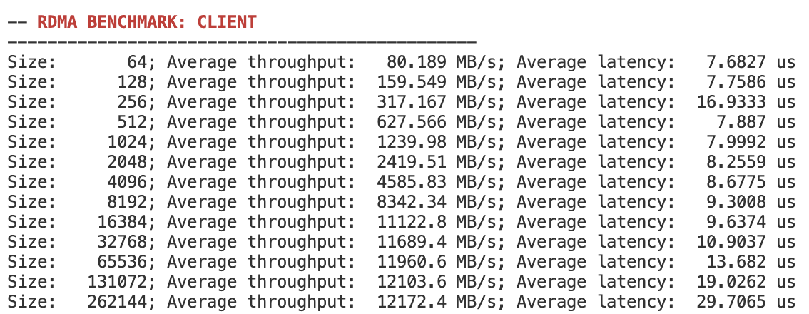
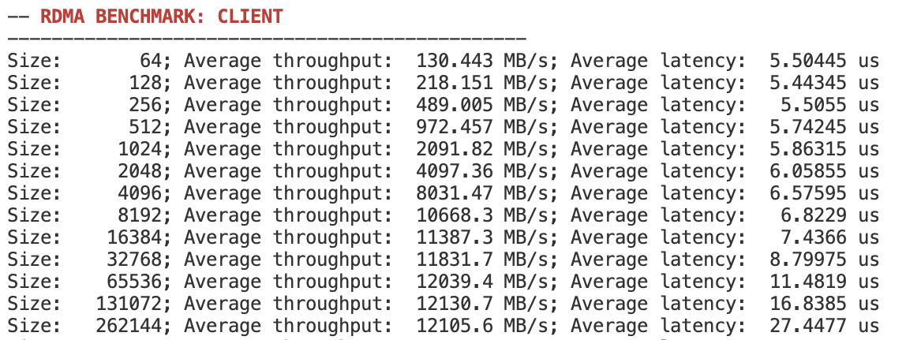

# Coyote Example 10: Inline DLRM Preprocessing on the RDMA Receive Path with GPU Staging
This example combines two concepts from earlier examples — `09_preprocess` (FPGA-side DLRM preprocessing) and `08_perf_rdma` (FPGA-as-SmartNIC for 100G RoCE v2) — and stages the resulting data into a GPU buffer on the receiver side. The client and server exchange a buffer over RDMA; on the receiver, an HLS preprocessing kernel sits inline on the RDMA receive datapath inside the vFPGA, transforming the incoming stream before it is DMA'd to host memory and then copied to the GPU. Like the other RDMA examples, two FPGA-equipped nodes are required.

##### Table of Contents
[Folder Layout](#folder-layout)

[RDMA Recap](#rdma-recap)

[Example Overview](#example-overview)

[Hardware Concepts](#hardware-concepts)

[Software Concepts](#software-concepts)

[Building and Running](#building-and-running)

[Additional Information](#additional-information)

[Status and Known Issues](#status-and-known-issues)

## Folder Layout
```
hw/
  CMakeLists.txt                 FPGA project (EN_RDMA=1, 1 vFPGA, 2 host streams)
  src/vfpga_top.svh              vFPGA wiring; instantiates hls_vadd on the RDMA-RX path
  src/init_ip.tcl                ILA IP for optional debug probing
  src/hls/hls_vadd/              HLS preprocessing kernel (despite the name, no vector-add)
sw/
  CMakeLists.txt                 Selects client vs server build via -DINSTANCE
  src/include/constants.hpp      Bench parameters, default vFPGA / GPU IDs
  src/client/main.cpp            Active client: CPU RDMA buffer + GPU buffer + hipMemcpy per completion
  src/client/main_rdma_gpu.cpp   Variant: GPU-direct RDMA via initRDMA_GPU (no CPU staging)
  src/client/main_rdma_cpu_gpu.cpp  Earlier draft of the active client; kept for reference
  src/server/main.cpp            Active server: passive for READ, ack-and-mirror for WRITE
  src/server/main_rdma_gpu.cpp   Variant kept for reference
  src/client/extract_output.txt  Saved benchmark numbers from a previous run
img/                             Diagrams used in this README
```

The CMake build always compiles `src/<role>/main.cpp`. The `*_rdma_gpu.cpp` and `*_rdma_cpu_gpu.cpp` files are alternate implementations and are **not** built unless they are renamed over `main.cpp`.

## RDMA Recap
A full description of RoCE v2, Queue Pairs and the Coyote RDMA stack lives in [`examples/08_perf_rdma`](../08_perf_rdma/README.md). The terminology used below is the same:
- *QPN*: Queue Pair Number — identifies a connection between two remote nodes.
- *vaddr / rkey*: Virtual address and remote key of the network-exposed buffer; exchanged out-of-band over TCP before the RDMA flow starts.
- *PSN*: Packet Sequence Number, used by the FPGA RDMA stack to order packets and detect drops.
- *MTU*: Maximum Transmission Unit; default 4 KB in Coyote.

Coyote implements the two one-sided RDMA verbs (`RDMA WRITE` and `RDMA READ`); both are used as-is in this example.

**IMPORTANT:** As with `08_perf_rdma`, always launch the **server software first**, then the client. The server is the passive party in the out-of-band TCP exchange that bootstraps the QP.

## Example Overview
The high-level flow on the client is:
1. *QP exchange and setup* — same as in `08_perf_rdma`: an out-of-band TCP exchange of IPs / vaddrs / rkeys / initial PSN, then both CPUs forward the aggregated info to their FPGAs.
2. *RDMA transfer* — the client issues `REMOTE_RDMA_WRITE` or `REMOTE_RDMA_READ` against the remote buffer.
3. *Inline preprocessing* — incoming RDMA-RX data on the client (`axis_rreq_recv[0]`) is fed into the `hls_vadd` HLS kernel before being DMA'd to host memory. See [Hardware Concepts](#hardware-concepts).
4. *Host → GPU staging* — when a `LOCAL_WRITE` completion fires (i.e. the preprocessed payload has landed in the CPU buffer), the client immediately does a `hipMemcpy(..., HostToDevice)` to forward it to the GPU buffer. This is the "CPU-staged" path; a GPU-direct variant exists in `main_rdma_gpu.cpp`.

The benchmark sweeps transfer sizes from `min_size` to `max_size` (doubling each step) and reports per-size throughput and latency. The throughput-mode loop issues `N_THROUGHPUT_REPS = 64` transfers per measurement and the latency loop issues `N_LATENCY_REPS = 1` ([sw/src/include/constants.hpp](sw/src/include/constants.hpp)).

## Hardware Concepts
The vFPGA has the same RDMA control wiring as `08_perf_rdma` — `rq_wr/rq_rd` are forwarded into `sq_wr/sq_rd` with `strm = STRM_HOST` — but the RX-side data wiring is **modified** to route the inbound RDMA payload through an HLS preprocessing kernel instead of looping it straight to host:

```Verilog
// Outgoing RDMA WRITEs (host -> network)
`AXISR_ASSIGN(axis_host_recv[0], axis_rreq_send[0])

// Incoming RDMA payload (network -> hls_vadd -> host) -- replaces the direct loopback
hls_vadd inst_vadd(
    .s_axi_in_TDATA   (axis_rreq_recv[0].tdata),
    .s_axi_in_TKEEP   (axis_rreq_recv[0].tkeep),
    .s_axi_in_TLAST   (axis_rreq_recv[0].tlast),
    .s_axi_in_TVALID  (axis_rreq_recv[0].tvalid),
    .s_axi_in_TREADY  (axis_rreq_recv[0].tready),

    .m_axi_out_TDATA  (axis_host_send[0].tdata),
    .m_axi_out_TKEEP  (axis_host_send[0].tkeep),
    .m_axi_out_TLAST  (axis_host_send[0].tlast),
    .m_axi_out_TVALID (axis_host_send[0].tvalid),
    .m_axi_out_TREADY (axis_host_send[0].tready),

    .ap_clk           (aclk),
    .ap_rst_n         (aresetn)
);

// RDMA READ-RESPONSE paths -- unchanged passthroughs
`AXISR_ASSIGN(axis_host_recv[1], axis_rrsp_send[0])
`AXISR_ASSIGN(axis_rrsp_recv[0], axis_host_send[1])
```

Only the inbound RDMA-payload stream on port 0 is preprocessed. The outbound TX path and the response paths on port 1 remain transparent passthroughs, so a node can still serve as a plain SmartNIC for traffic in those directions.

A commented-out ILA template (`ila_perf_rdma`) is included at the bottom of [`vfpga_top.svh`](hw/src/vfpga_top.svh) and its IP block is created in [`init_ip.tcl`](hw/src/init_ip.tcl) — uncomment both for waveform-level debug of the RDMA datapath.

### HLS Preprocessing Pipeline
The kernel — kept under the historical name `hls_vadd` even though it does not perform a vector add — operates on 512-bit AXIS beats (16 lanes × 32-bit). It is built as an HLS `dataflow` region of single-stage processes connected by FIFOs:

```
axi_in -> LoadData -> Dense_NegsToZero -> Dense_Log -> Dense_Log -> StoreData -> axi_out
```

Per-stage behaviour ([hw/src/hls/hls_vadd/hls_vadd.hpp](hw/src/hls/hls_vadd/hls_vadd.hpp)):
- `LoadData`: AXIS → internal struct stream.
- `Dense_NegsToZero`: per 32-bit lane, clamp negative values to zero (DLRM dense-feature step).
- `Dense_Log`: per 32-bit lane, compute `logf(x + 1)` and write back as `float` bits (DLRM dense-feature step).
- `StoreData`: internal struct stream → AXIS.

The intended sparse-feature stage (`Sparse_HexToIntMod`, a `& 0x3FF` modulo-1024 hash) is defined in the header but is **not** in the active pipeline — `hls_vadd.cpp` currently calls `Dense_Log` twice instead. See [Status and Known Issues](#status-and-known-issues).

## Software Concepts
The control flow follows the standard Coyote RDMA pattern. The added piece on the client is GPU staging.

```C++
// 1. Coyote thread (vFPGA = 0)
coyote::cThread<std::any> coyote_thread(DEFAULT_VFPGA_ID, getpid(), 0);

// 2. Allocate the host-side RDMA buffer and run the QP exchange against the server
int *mem_cpu = (int *) coyote_thread.initRDMA(max_size, coyote::defPort, server_ip.c_str());

// 3. Allocate a GPU-side buffer of the same size (separate from the RDMA buffer)
hipSetDevice(DEFAULT_GPU_ID);
int *mem_gpu = (int *) coyote_thread.getMem({coyote::CoyoteAlloc::GPU, max_size});
```

`initRDMA` does what it does in `08_perf_rdma` — it sizes and registers the host-side RDMA buffer and performs the QP exchange (server passes `nullptr` for the IP, client passes the server's CPU IP). `getMem({GPU, ...})` reserves a separate GPU buffer; it is **not** the RDMA target — the FPGA still DMAs into the CPU buffer.

The benchmark loop issues N RDMA operations and, for every `LOCAL_WRITE` completion (the FPGA-to-host DMA of one preprocessed payload), copies that buffer to the GPU:

```C++
for (int i = 0; i < transfers; i++)
    coyote_thread.invoke(coyote_operation, &sg);          // REMOTE_RDMA_WRITE or REMOTE_RDMA_READ

int completed = 0;
while (completed < transfers) {
    if (coyote_thread.checkCompleted(coyote::CoyoteOper::LOCAL_WRITE) > completed) {
        completed += 1;
        hipMemcpy(mem_gpu, mem_cpu, sg.rdma.len, hipMemcpyHostToDevice);
    }
}
```

For `RDMA WRITE` benchmarks the server bounces the same buffer back so the client gets the round-trip; for `RDMA READ` the server is fully passive and the response data flows back via `RDMA READ RESPONSE`. In both cases the client sees `N_THROUGHPUT_REPS` (or `N_LATENCY_REPS`) `LOCAL_WRITE` completions, and each one triggers a host→device copy.

### Variants
Two alternate client implementations live alongside the active one:
- [`main_rdma_gpu.cpp`](sw/src/client/main_rdma_gpu.cpp): uses `initRDMA_GPU(...)` to register the GPU buffer **directly** as the RDMA target — no CPU staging, no `hipMemcpy`. Useful for measuring GPU-direct RDMA into a preprocessed stream.
- [`main_rdma_cpu_gpu.cpp`](sw/src/client/main_rdma_cpu_gpu.cpp): an earlier draft of the active CPU-staged client; functionally near-identical to `main.cpp`.

The matching server-side variant is [`server/main_rdma_gpu.cpp`](sw/src/server/main_rdma_gpu.cpp). To use any of these, rename it over `main.cpp` (or extend [`sw/CMakeLists.txt`](sw/CMakeLists.txt) to point at the alternate file) before invoking CMake.

## Building and Running
### Hardware
```bash
cd hw/
mkdir build && cd build
cmake .. && make
```
This emits `example_10_preprocess_rdma`. Synthesis runs with `BUILD_OPT=1` because timing closure with the RDMA stack is tight; expect long build times.

### Software (server and client are different binaries)
Two CMake builds are required, selected with `-DINSTANCE=server|client`:
```bash
cd sw/

mkdir build_server && cd build_server
cmake ../../ -DINSTANCE=server && make

cd ../
mkdir build_client && cd build_client
cmake ../../ -DINSTANCE=client && make
```
The output binary is `test` in each build directory. The `AMD_GPU` cache variable defaults to `gfx90a` (MI210); override with `-DAMD_GPU=<arch>` if your GPU differs.

### Running
**Always start the server first**, then the client. The server is the passive party in the bootstrap TCP exchange.

```bash
# On the server node
./build_server/test [-o 0|1] [-r N] [-x MIN] [-X MAX]

# On the client node
./build_client/test -i <server-CPU-IP> [-o 0|1] [-r N] [-x MIN] [-X MAX]
```

The IP given to the client (`-i`) must be the **server CPU's** address on the management network used for the TCP bootstrap, **not** the server FPGA's data-network address. Use `ifconfig` on the server to find it.

CLI parameters:
- `[--ip_address | -i] <string>` — server CPU IP (client only).
- `[--operation | -o] <0|1>` — `0` = RDMA READ (default), `1` = RDMA WRITE.
- `[--runs | -r] <uint>` — number of repetitions per data point. Default: `10`.
- `[--min_size | -x] <uint>` — start of the size sweep, in bytes. Default: `64`.
- `[--max_size | -X] <uint>` — end of the size sweep, in bytes. Default: `1048576` (1 MB).

Each row in the output reports throughput at `N_THROUGHPUT_REPS = 64` and latency at `N_LATENCY_REPS = 1`. A previous run is captured in [`sw/src/client/extract_output.txt`](sw/src/client/extract_output.txt).

## Additional Information

### Network debugging
Coyote's per-port RoCE counters can be queried directly from sysfs and are usually the fastest way to confirm whether a transfer made it onto the wire:
```bash
cat /sys/kernel/coyote_sysfs_0/cyt_attr_nstats
```
A healthy run looks similar to:
```
 -- NET STATS QSFP0
RX pkgs: 316
TX pkgs: 242
ROCE RX pkgs: 245
ROCE TX pkgs: 240
IBV RX pkgs: 240
IBV TX pkgs: 240
PSN drop cnt: 0
Retrans cnt: 0
STRM down: 0
```
`STRM down: 1` means the network stack has shut down; the only recovery is to reprogram the FPGA. Beyond these counters, you can also use a 100G traffic sniffer (covered in the next example) for `pcap`-level inspection, or fall back to ILA probing on the data/control paths inside the vFPGA.

### Expected results
The reference plots from `08_perf_rdma` for read and write are reproduced below. Numbers in this example will deviate because the receive path now includes the HLS preprocessing kernel.

<p align="middle">
  
  
</p>

## Status and Known Issues
This example is a work in progress; the points below are visible in the source and worth being aware of when reading or extending the code:

- **Pipeline stage placeholder.** [`hls_vadd.cpp`](hw/src/hls/hls_vadd/hls_vadd.cpp) calls `Dense_Log` twice instead of running `Sparse_HexToIntMod` after it. The `Sparse_HexToIntMod` function is defined in the header but currently commented out at the call site.
- **Float / int handling in dense stages.** Inside `Dense_NegsToZero` and the input side of `Dense_Log`, the 32-bit lane is read into a plain `int tmp_value` and then compared to `0` / passed to `hls::logf` directly. For real `float` inputs this treats the float bit-pattern as a signed integer, which gives the wrong answer for any negative-signed-bit float. The intended pattern (re-interpret through the `conv` union, operate as `float`, write back as `uint32`) is only applied on the output side of `Dense_Log`. Worth fixing before relying on the numeric output.
- **Module name.** The HLS module is still called `hls_vadd` even though it no longer performs a vector add; renaming would touch both [`vfpga_top.svh`](hw/src/vfpga_top.svh) and the HLS sources/CMake glue.
- **Variants are not built by default.** The `*_rdma_gpu.cpp` / `*_rdma_cpu_gpu.cpp` files have to be swapped in manually — `sw/CMakeLists.txt` only ever compiles `main.cpp` for the selected role.
